# Gate Skills

[English](README.md) | [中文](README_zh.md)

Gate Skills 是一个开放的技能市场，让 AI Agent 能够原生接入 gate.com 的加密生态。从市场分析、衍生品监控到一键 MCP 配置，全部可通过自然语言完成。

由 gate.com 构建，为加密社区而生。

### 一键安装

使用我们的安装器 skill，秒级完成配置：

- **Cursor 用户**：使用 `gate-mcp-cursor-installer` — 一条命令安装全部 Gate MCP 服务器 + Skills
- **OpenClaw 用户**：使用 `gate-mcp-openclaw-installer` — 完整的 Gate MCP 安装器，支持交互式选择
- **Claude Code (Claude CLI) 用户**：使用 `gate-mcp-claude-installer` — 一键安装全部 Gate MCP + 全部 Gate Skills
- **Codex 用户**：使用 `gate-mcp-codex-installer` — 一键安装全部 Gate MCP + 全部 Gate Skills

**快速开始**：只需对 AI 助手说：

> **"帮我自动安装 Gate Skills 和 MCP：https://github.com/gate/gate-skills"**

或直接从仓库运行安装脚本。

### 框架兼容性

这些 skills 设计为可兼容任意 AI Agent 框架。无论你使用 Cursor、OpenClaw，还是自研 Agent 栈，都可以通过最少配置接入 gate.com 的加密智能能力。

---

## Skills 总览

| Skill | 描述 | 版本 | 状态 |
|-------|------|------|------|
| [gate-exchange-subaccount](#-gate-exchange-subaccount) | Gate 子账户管理：查询状态、列表、创建、锁定/解锁子账户 | `2026.3.12-1` | ✅ Active |
| [gate-info-coinanalysis](#-gate-info-coinanalysis) | 单币种综合分析：基本面、技术面、新闻、社交情绪 | `2026.3.12-2` | ✅ Active |
| [gate-info-addresstracker](#-gate-info-addresstracker) | 链上地址追踪：地址画像、交易历史、资金流向分析 | `2026.3.12-1` | ✅ Active |
| [gate-info-coincompare](#-gate-info-coincompare) | 多币种对比：多维度对比表与总结 | `2026.3.12-1` | ✅ Active |
| [gate-info-marketoverview](#-gate-info-marketoverview) | 加密市场总览：板块排行、DeFi、事件、宏观摘要 | `2026.3.12-1` | ✅ Active |
| [gate-info-riskcheck](#-gate-info-riskcheck) | 代币与合约风险评估：蜜罐检测、Rug Pull、税费、持币集中度 | `2026.3.12-1` | ✅ Active |
| [gate-info-trendanalysis](#-gate-info-trendanalysis) | 趋势与技术分析：K线、RSI、MACD、多周期信号 | `2026.3.12-1` | ✅ Active |
| [gate-news-briefing](#-gate-news-briefing) | 加密新闻简报：重大事件、热门新闻、社交情绪 | `2026.3.12-1` | ✅ Active |
| [gate-news-eventexplain](#-gate-news-eventexplain) | 事件归因与解释：价格异动原因追溯与影响链分析 | `2026.3.12-1` | ✅ Active |
| [gate-news-listing](#-gate-news-listing) | 交易所上架/下架追踪：公告监控与新币基本面补充 | `2026.3.12-1` | ✅ Active |
| [gate-dex-market](#-gate-dex-market) | Gate DEX 行情数据（OpenAPI 模式）：代币信息、K线、排行、安全审计 | `2026.3.12-1` | ✅ Active |
| [gate-dex-trade](#-gate-dex-trade) | Gate DEX 交易：MCP + OpenAPI 双模式，智能路由执行 Swap | `2026.3.12-1` | ✅ Active |
| [gate-mcp-claude-installer](#-gate-mcp-claude-installer) | 为 Claude Code (Claude CLI) 提供的一键安装 Gate MCP 与 Skills | `2026.3.11-1` | ✅ Active |
| [gate-mcp-codex-installer](#-gate-mcp-codex-installer) | 为 Codex 提供的一键安装 Gate MCP 与 Skills | `2026.3.11-1` | ✅ Active |
| [gate-exchange-marketanalysis](#-gate-exchange-marketanalysis) | 市场盘口分析：流动性、动量、爆仓、资金费套利、基差、操纵风险、订单簿解读、滑点模拟、K线突破、周末与工作日对比 | `2026.3.11-1` | ✅ Active |
| [gate-mcp-cursor-installer](#-gate-mcp-cursor-installer) | 为 Cursor 提供的一键安装 Gate MCP 与 Skills 脚本 | `2026.3.10-1` | ✅ Active |
| [gate-mcp-openclaw-installer](#-gate-mcp-openclaw-installer) | 为 OpenClaw 提供的 Gate MCP 完整安装器 | `2026.3.10-1` | ✅ Active |
| [gate-exchange-spot](#-gate-exchange-spot) | Gate 现货交易：买卖下单、订单管理、账户查询、资产兑换 | `2026.3.10-1` | ✅ Active |
| [gate-dex-wallet](#-gate-dex-wallet) | Gate DEX 综合钱包：身份认证、资产查询、转账执行、DApp 交互 | `2026.3.10-1` | ✅ Active |
| [gate-exchange-futures](#-gate-exchange-futures) | Gate 合约交易：开仓、平仓、撤单、改单 | `2026.3.5-1` | ✅ Active |
| [gate-exchange-assets](#-gate-exchange-assets) | Gate 交易所资产查询：总资产、现货持仓、账户估值、账户流水（只读） | `2026.3.12-3` | ✅ Active |
| [gate-exchange-dual](#-gate-exchange-dual) | Gate 双币理财：产品发现、结算模拟、持仓与余额查询（只读） | `2026.3.12-1` | ✅ Active |
| [gate-exchange-staking](#-gate-exchange-staking) | Gate 理财/质押：持仓、收益、产品发现、订单历史（只读） | `2026.3.12-1` | ✅ Active |

---

## 👥 gate-exchange-subaccount

> **路径**: `skills/gate-exchange-subaccount/`

Gate 交易所子账户管理：按 UID 查询状态、列出全部子账户、创建子账户、锁定/解锁子账户。写操作需用户明确确认。

**示例提示词**：
- `子账户 UID 123456 的状态是什么？`
- `显示我所有的子账户`
- `创建一个新的子账户`
- `锁定子账户 UID 123456` / `解锁子账户 UID 123456`

---

## 📈 gate-exchange-marketanalysis

> **路径**: `skills/gate-exchange-marketanalysis/`

只读市场盘口分析，涵盖十个场景：流动性、动量、爆仓监控、资金费套利、基差、操纵风险、订单簿解读、滑点模拟、K线突破/支撑阻力，以及周末与工作日成交量对比。

**示例提示词**：
- `Check BTC liquidity and slippage`
- `What is the momentum of ETH?`
- `Simulate a $10K market buy on ETH`
- `Is there manipulation risk on DOGE?`
- `Compare BTC weekend vs weekday volume`

---

## 📊 gate-exchange-futures

> **路径**: `skills/gate-exchange-futures/`

Gate 交易所 USDT 永续合约交易，支持四类操作：开仓、平仓、撤单、改单。含盘前检查、保证金/杠杆处理，以及下单前用户确认机制。

**示例提示词**：
- `Long BTC 1 contract with 10x leverage`
- `Close all ETH positions`
- `Cancel my BTC buy order`
- `Change order price to 60000`

---

## 💱 gate-exchange-spot

> **路径**: `skills/gate-exchange-spot/`

Gate 现货交易，支持市价/限价买卖、条件单、订单管理（改单/撤单）、账户查询、成交验证和资产兑换。所有下单操作需用户明确确认。

**示例提示词**：
- `Buy 100 USDT worth of BTC`
- `Sell ETH when price hits 3500`
- `Cancel my unfilled BTC order and check balance`
- `Swap USDT to SOL`

---

## 📦 gate-exchange-assets

> **路径**: `skills/gate-exchange-assets/`

Gate 交易所只读资产与余额查询：总资产、现货持仓、USDT 估值、账户流水。不涉及交易或划转。

**示例提示词**：
- `我的账户总价值多少？`
- `查一下我的 USDT 余额`
- `显示我的总资产`
- `我的 BTC 余额是多少？`
- `显示最近 BTC 账户流水和当前余额`

---

## 📋 gate-exchange-dual

> **路径**: `skills/gate-exchange-dual/`

Gate 交易所双币理财：浏览产品（APY、目标价）、结算模拟、查看持仓与余额。只读，不支持下单。

**示例提示词**：
- `有哪些 BTC 双币理财计划？`
- `卖高目标价 62000，如果涨到 65000 会怎样？`
- `双币理财持仓汇总`
- `双币里锁了多少？`

---

## 🪙 gate-exchange-staking

> **路径**: `skills/gate-exchange-staking/`

Gate 理财/质押查询：持仓、收益、产品发现、订单历史。只读，不支持申购/赎回操作。

**示例提示词**：
- `显示我的质押持仓`
- `我的质押收益是多少？`
- `找一下 BTC 的理财产品`
- `显示理财/质押历史`

---

## 📊 gate-dex-market

> **路径**: `skills/gate-dex-market/`

Gate DEX 行情数据 Skill，使用 OpenAPI 模式通过 AK/SK 认证直接调用 API。提供代币信息、K线数据、排行榜、安全审计等只读查询。

**示例提示词**：
- `查询 BTC 代币信息`
- `显示 ETH 的 K 线数据`
- `最近有什么热门代币？`
- `检查这个代币的安全审计`

---

## 🔄 gate-dex-trade

> **路径**: `skills/gate-dex-trade/`

Gate DEX 交易综合 Skill，支持 MCP + OpenAPI 双模式。智能路由根据环境自动选择最优交易方式，支持跨链与单链 Swap 执行。

**示例提示词**：
- `用 100 USDT 兑换 ETH`
- `把 BNB 换成 PEPE`
- `获取 SOL 换 USDC 的报价`
- `使用 OpenAPI 模式买入代币`

---

## 💼 gate-dex-wallet

> **路径**: `skills/gate-dex-wallet/`

Gate DEX 综合钱包 Skill。统一入口，支持身份认证、资产查询、转账执行、DApp 交互四大模块，根据用户意图路由到具体子模块。

**示例提示词**：
- `登录我的钱包`
- `查看钱包余额`
- `转账 0.1 ETH 到 0x...`
- `将钱包连接到 Uniswap`
- `签名这条消息`

---

## 🔍 gate-info-addresstracker

> **路径**: `skills/gate-info-addresstracker/`

链上地址追踪与分析。提供地址画像、交易历史与资金流向追踪，支持基础查询和深度追踪两种模式，覆盖多链地址。

**示例提示词**：
- `追踪这个地址 0x...`
- `这个地址的持有者是谁？`
- `查看 bc1... 的资金流向`
- `检查地址活动`

---

## 📊 gate-info-coinanalysis

> **路径**: `skills/gate-info-coinanalysis/`

单币种综合分析。并行获取基本面、行情、技术面、新闻和社交情绪数据，由 LLM 汇总为结构化分析报告。

**示例提示词**：
- `分析一下 ETH`
- `SOL 现在怎么样？`
- `BTC 现在值得买吗？`
- `帮我全面分析 DOGE`

---

## ⚖️ gate-info-coincompare

> **路径**: `skills/gate-info-coincompare/`

多币种对比（2–5 个币种）。并行获取各币种行情快照和基本面数据，生成多维度对比表与总结。

**示例提示词**：
- `对比 BTC 和 ETH`
- `SOL 和 AVAX 哪个更好？`
- `对比 BTC、ETH、SOL 和 BNB`
- `DOGE 和 SHIB 有什么区别？`

---

## 🌐 gate-info-marketoverview

> **路径**: `skills/gate-info-marketoverview/`

加密市场总览。并行获取全市场数据、板块排行、DeFi 概览、近期事件和宏观摘要，生成市场简报式报告。

**示例提示词**：
- `今天市场怎么样？`
- `给我一个市场概览`
- `加密市场最近发生了什么？`
- `展示整体市场状况`

---

## 🛡️ gate-info-riskcheck

> **路径**: `skills/gate-info-riskcheck/`

代币与合约风险评估。执行 30+ 项风险检查，包括蜜罐检测、税费分析、持币集中度和名称风险等，生成结构化风险报告。

**示例提示词**：
- `这个代币安全吗？0x...`
- `检查 PEPE 的合约风险`
- `这是蜜罐吗？`
- `这个会不会是 Rug Pull？`

---

## 📉 gate-info-trendanalysis

> **路径**: `skills/gate-info-trendanalysis/`

趋势与技术分析。并行获取 K 线数据、指标历史、多周期信号和行情快照，生成多维度技术分析报告。

**示例提示词**：
- `BTC 技术分析`
- `看一下 ETH 的 RSI 和 MACD`
- `SOL 的趋势如何？`
- `查看 BNB 的支撑和阻力位`

---

## 📰 gate-news-briefing

> **路径**: `skills/gate-news-briefing/`

加密新闻简报。并行获取重大事件、热门新闻和社交情绪，生成分层新闻简报。

**示例提示词**：
- `最近加密圈发生了什么？`
- `今天的加密货币头条`
- `市场有什么新动态？`
- `给我最新的加密新闻`

---

## 💡 gate-news-eventexplain

> **路径**: `skills/gate-news-eventexplain/`

事件归因与解释。当用户询问价格异动原因时，多步调用追溯事件来源，结合行情和链上数据，输出「事件 → 影响链 → 市场反应」分析报告。

**示例提示词**：
- `BTC 为什么暴跌？`
- `ETH 刚才怎么了？`
- `SOL 为什么在涨？`
- `DOGE 暴跌的原因是什么？`

---

## 📋 gate-news-listing

> **路径**: `skills/gate-news-listing/`

交易所上架/下架追踪。获取交易所上新、下架和维护公告，为高关注度新币补充基本面和行情数据。

**示例提示词**：
- `最近有什么新币上架？`
- `币安这周上了什么币？`
- `查看最近的下架公告`
- `今天有新代币上线吗？`

---

## 🛠️ gate-mcp-cursor-installer

> **路径**: `skills/gate-mcp-cursor-installer/`

专为 Cursor 环境提供的 Gate MCP 及 Skills 一键安装脚本。

**快速开始**：
```bash
bash scripts/install.sh
```

---

## 🛠️ gate-mcp-openclaw-installer

> **路径**: `skills/gate-mcp-openclaw-installer/`

专为 OpenClaw 环境提供的 Gate MCP 完整安装器，支持配置现货/合约交易、钱包、行情与新闻服务器。

**快速开始**：
```bash
./scripts/install.sh
```

---

## 🛠️ gate-mcp-claude-installer

> **路径**: `skills/gate-mcp-claude-installer/`

专为 **Claude Code（Claude CLI）** 提供的一键安装 Gate MCP 与全部 Gate Skills。

**快速开始**：
```bash
# 在仓库根目录执行
bash skills/gate-mcp-claude-installer/scripts/install.sh
```

可选：`--no-skills` 仅安装 MCP；`--mcp main --mcp dex` 等只安装指定 MCP。

---

## 🛠️ gate-mcp-codex-installer

> **路径**: `skills/gate-mcp-codex-installer/`

专为 **Codex** 提供的一键安装 Gate MCP 与全部 Gate Skills。

**快速开始**：
```bash
# 在仓库根目录执行
bash skills/gate-mcp-codex-installer/scripts/install.sh
```

可选：`--no-skills` 仅安装 MCP；`--mcp main --mcp dex` 等只安装指定 MCP。

---

## 快速开始

### 前置要求

- 支持 skill 加载的 AI Agent 环境（例如 Cursor、OpenClaw）
- Node.js 与 npm

### 配置步骤

根据你的环境选择对应的安装器：

#### Cursor 用户

使用 `gate-mcp-cursor-installer` 一键安装 Gate MCP 和 Skills：

```bash
# 执行安装脚本
bash skills/gate-mcp-cursor-installer/scripts/install.sh
```

或直接向 AI 助手说：
```
帮我安装 Gate MCP
```

#### OpenClaw 用户

使用 `gate-mcp-openclaw-installer`：

```bash
# 安装全部 Gate MCP 服务器（默认）
./skills/gate-mcp-openclaw-installer/scripts/install.sh

# 选择性安装
./skills/gate-mcp-openclaw-installer/scripts/install.sh --select
```

#### Claude Code (Claude CLI) 用户

使用 `gate-mcp-claude-installer` 一键安装全部 Gate MCP 与 Gate Skills：

```bash
# 在仓库根目录执行
bash skills/gate-mcp-claude-installer/scripts/install.sh
```

仅安装 MCP：`bash skills/gate-mcp-claude-installer/scripts/install.sh --no-skills`

#### Codex 用户

使用 `gate-mcp-codex-installer` 一键安装全部 Gate MCP 与 Gate Skills：

```bash
# 在仓库根目录执行
bash skills/gate-mcp-codex-installer/scripts/install.sh
```

仅安装 MCP：`bash skills/gate-mcp-codex-installer/scripts/install.sh --no-skills`

### 开始使用 Skills

安装完成后，向 AI Agent 提出任意市场或交易问题即可。

---

## Skills 安装说明

### 通用安装（推荐）

1. 检查是否已安装 `npx`（未安装见附录）：

   ```bash
   npx -v
   ```

   若返回版本号（例如 `11.8.0`），说明 `npx` 已安装。

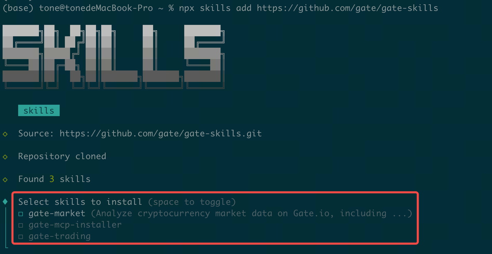

2. 通过交互方式安装 skills：

   ```bash
   npx skills add https://github.com/gate/gate-skills
   ```

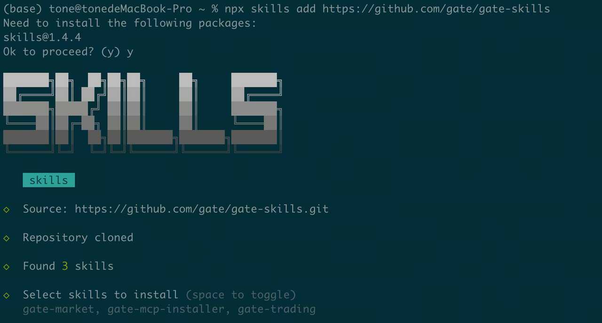

3. 安装指定 skill（示例：`gate-market`）：

   ```bash
   npx skills add https://github.com/gate/gate-skills --skill gate-market
   ```

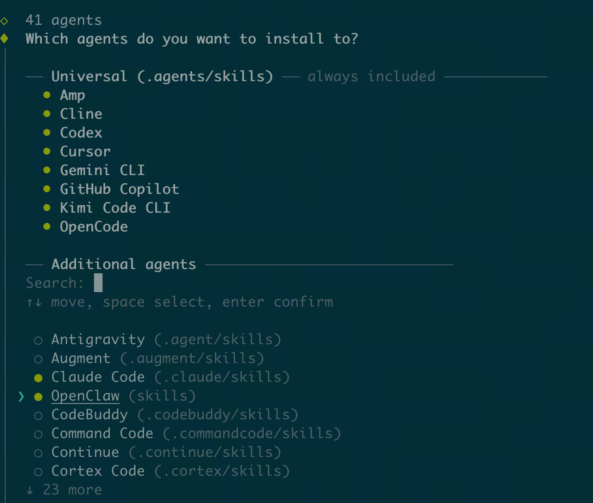

### 在 Claude CLI 中安装 Skills

#### 方式一：自然语言安装（推荐）

```text
help me to install skills, github url is: https://github.com/gate/gate-skills
```

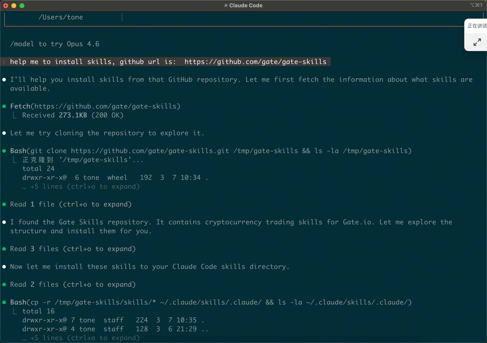

安装完成。

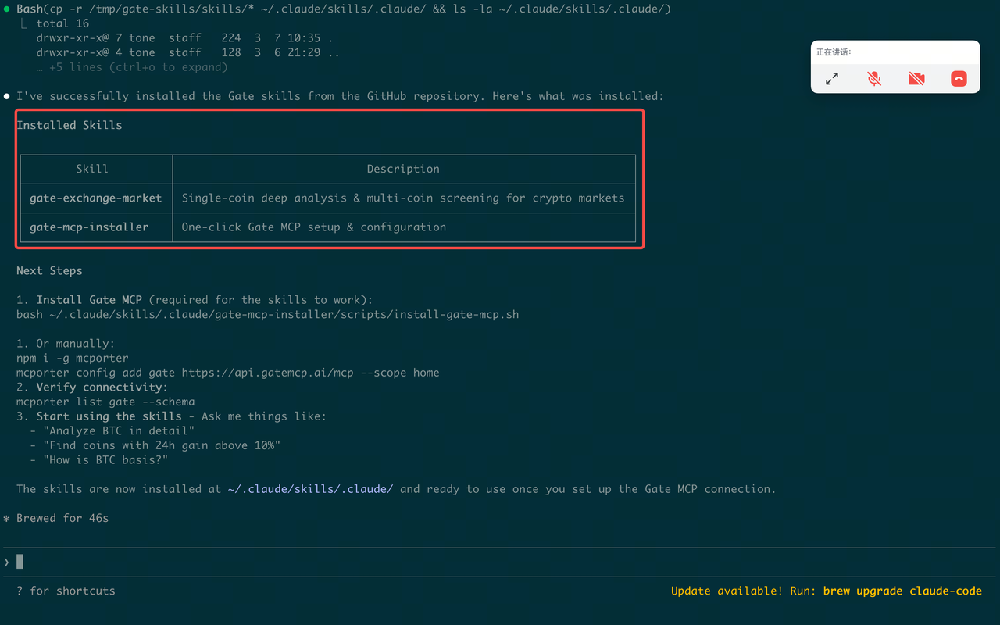

#### 方式二：手动安装

Step 1：下载 Skills 包（GitHub：<https://github.com/gate/gate-skills>）

Step 2：解压后复制到 `~/.claude/skills/` 目录。

- 显示隐藏目录：打开用户主目录后按 `Command + Shift + .`（再次按下可隐藏）
- 复制到目标路径：将 `gate-skills-master` 中的 `skills` 子目录复制到 `~/.claude/skills/`
- 验证安装：在 Claude CLI 输入 `/skills`，或提问 `how many skills have I installed?`

### 在 Codex CLI 中安装 Skills

#### 方式一：自然语言安装（推荐）

```text
help me to install skills, github url is: https://github.com/gate/gate-skills
```

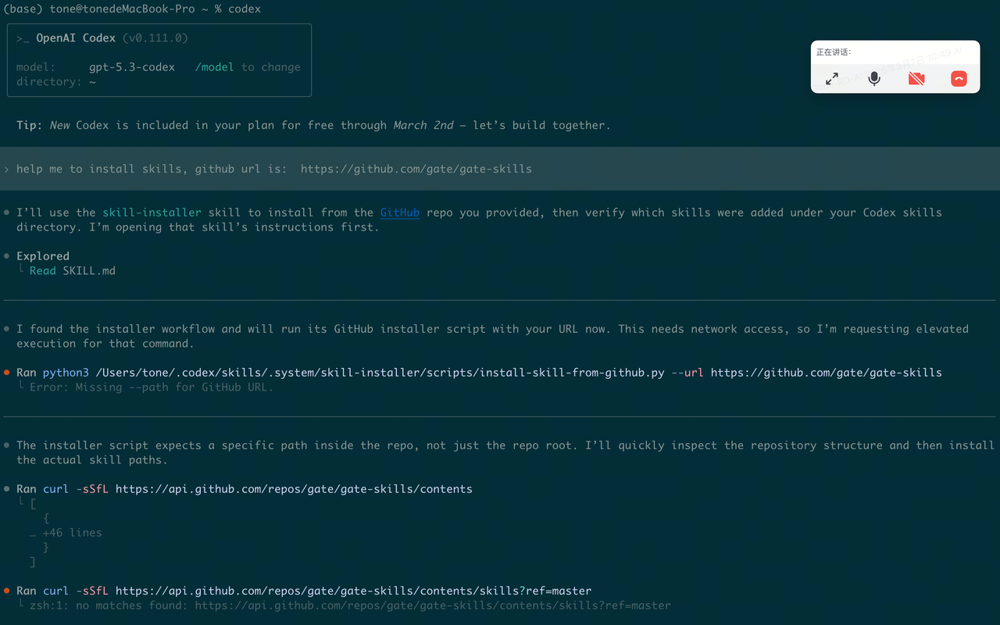

重启 Codex 后生效。

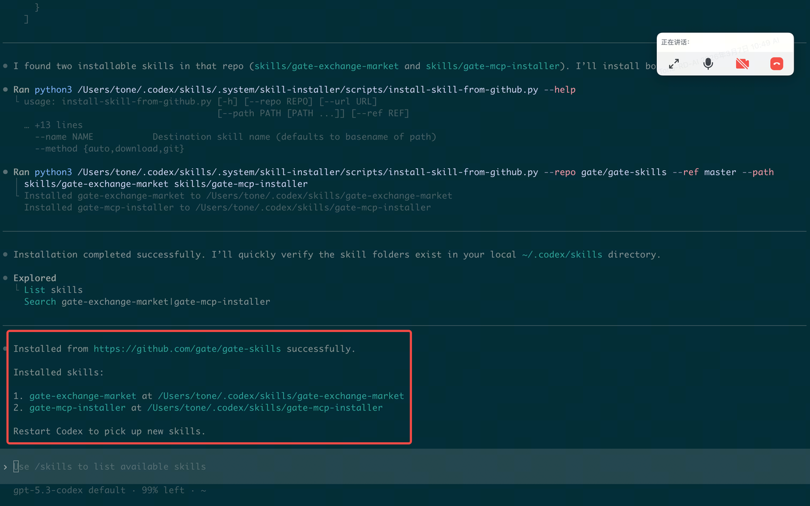

#### 方式二：终端安装

1. 在终端输入 `/skills`，选择 `1. List skills`，再选择 `Skill Installer`，输入 `https://github.com/gate/gate-skills`

   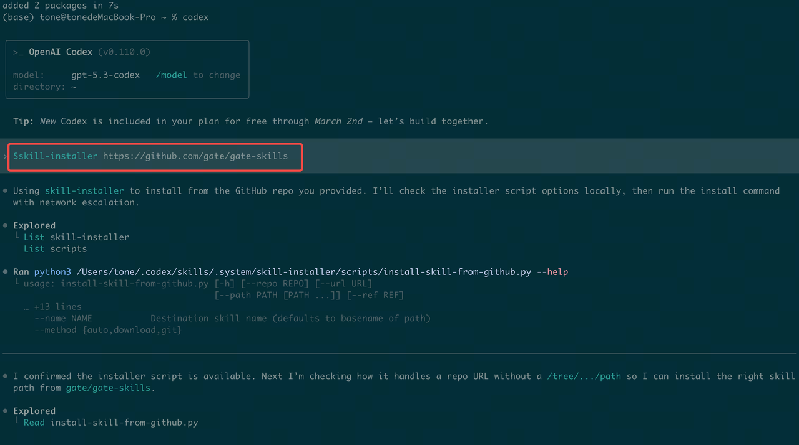
   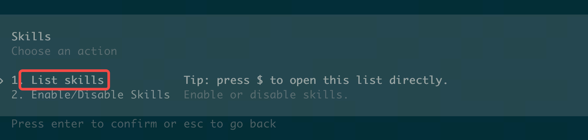
   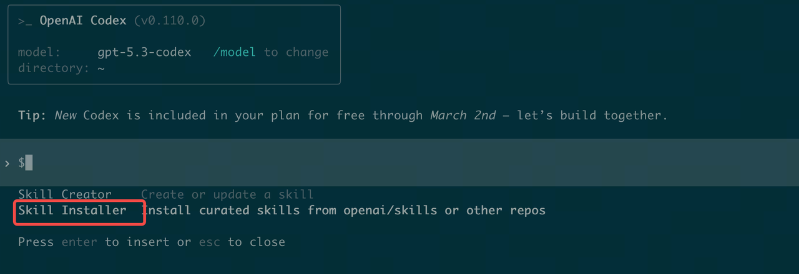
   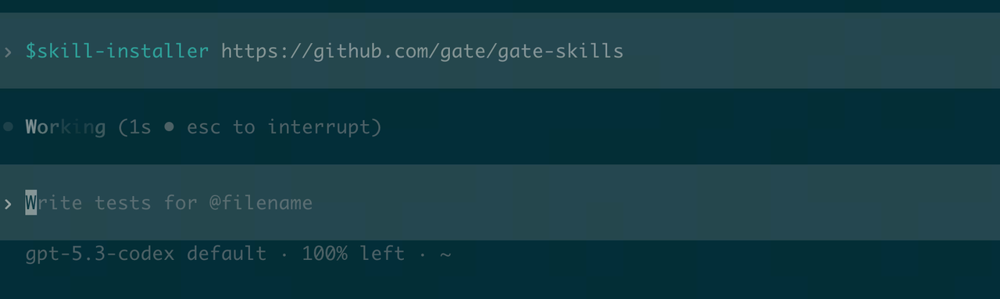

2. 验证安装：重启终端后执行 `/skills` -> `List Skills`

   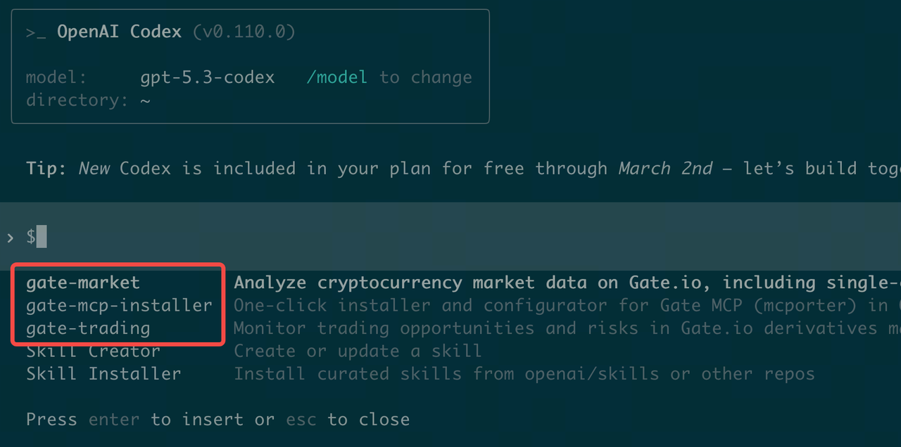

#### 方式三：手动安装

Step 1：下载 Skills 包（GitHub：<https://github.com/gate/gate-skills>）


Step 2：解压后复制到 `~/.codex/skills/` 目录。

1. 显示隐藏目录：打开用户主目录后按 `Command + Shift + .`（再次按下可隐藏）

   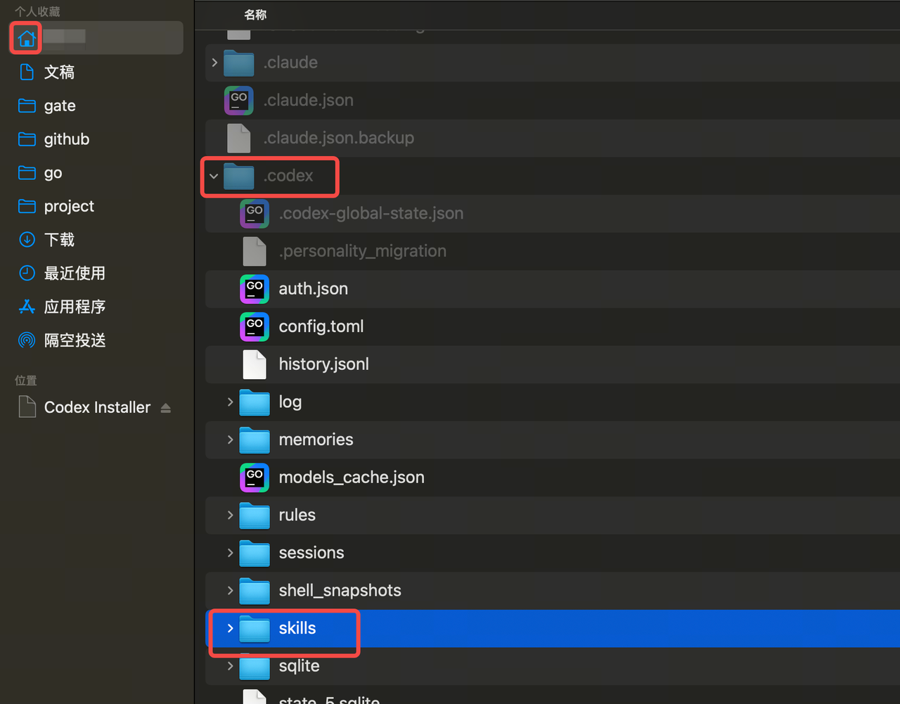

2. 复制到目标路径：将 `gate-skills-master` 中所有 `skills` 子目录复制到 `~/.codex/skills/`

   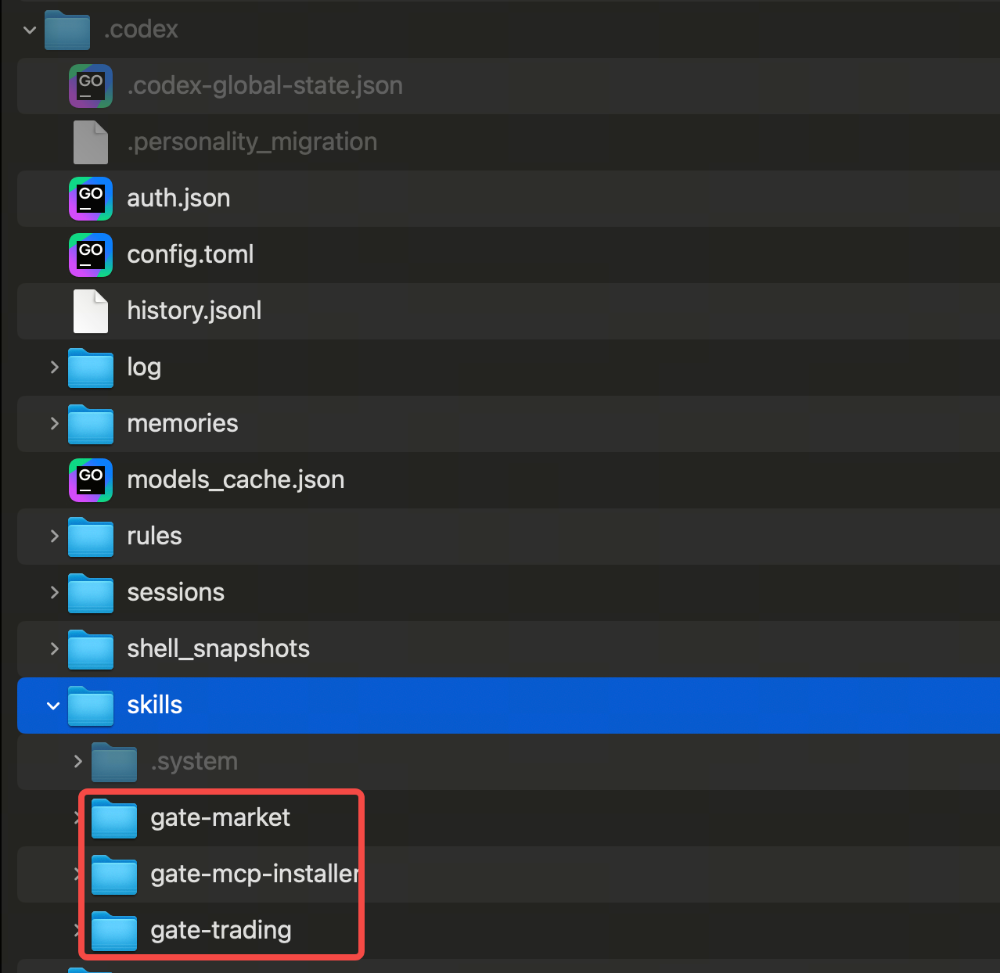

3. 验证安装：重启终端后执行 `/skills` -> `List Skills`

   

### 在 OpenClaw 中安装 Skills

#### 方式一：对话安装（推荐）

在 OpenClaw 聊天界面（如 Telegram、飞书）直接发送 GitHub 链接给助手，例如：

```text
帮我安装这个技能：https://github.com/gate/gate-skills
```

助手会自动拉取仓库、配置环境并尝试加载该 skill。

#### 方式二：使用 ClawHub 自动安装（推荐）

- 官方市场（需先安装 `npx`，见附录）：

  ```bash
  npx clawhub@latest install gate-skills
  ```

- GitHub 仓库：

  ```bash
  npx clawhub@latest add https://github.com/gate/gate-skills
  ```

#### 方式三：手动安装

Step 1：下载 Skills 包（GitHub：<https://github.com/gate/gate-skills>）

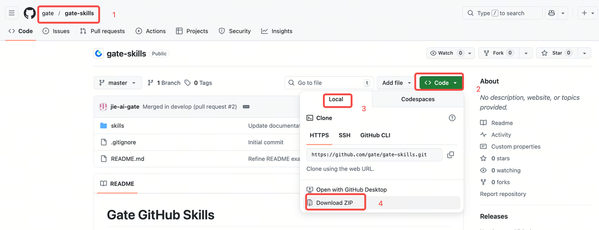

Step 2：解压后复制到 `~/.openclaw/skills/` 目录。

1. 显示隐藏目录：打开用户主目录后按 `Command + Shift + .`（再次按下可隐藏）
2. 复制到目标路径：将 `gate-skills-master` 中所有 `skills` 子目录复制到 `~/.openclaw/skills/`

Step 3：重启 OpenClaw Gateway。

### 附录：macOS 安装 npx

1. 检查是否已安装 `npx`：

   ```bash
   npx -v
   ```

   若返回版本号（例如 `11.8.0`），说明 `npx` 已安装。

2. 若未安装，可使用以下方式：

   - 方式一：通过 Homebrew 安装

     ```bash
     # 安装 Homebrew（官方）
     /bin/bash -c "$(curl -fsSL https://raw.githubusercontent.com/Homebrew/install/HEAD/install.sh)"

     # 安装 Homebrew（国内镜像）
     /bin/zsh -c "$(curl -fsSL https://gitee.com/cunkai/HomebrewCN/raw/master/Homebrew.sh)"

     # 验证 Homebrew
     brew --version

     # 安装 Node.js（包含 npx）
     brew install node

     # 验证 npx
     npx -v
     ```

   - 方式二：从 Node.js 官网下载安装包：
     <https://nodejs.org/en/download>

---

## 仓库结构

```
gate-github-skills/
├── README.md
├── README_zh.md
├── image/                              # 安装截图
└── skills/
    ├── gate-dex-market/                # DEX 行情数据 skill（OpenAPI 模式）
    ├── gate-dex-trade/                 # DEX 交易 skill（MCP + OpenAPI 双模式）
    ├── gate-dex-wallet/                # DEX 综合钱包 skill
    ├── gate-exchange-assets/           # 交易所资产/余额查询（只读）
    ├── gate-exchange-dual/             # 双币理财查询（只读）
    ├── gate-exchange-futures/          # 合约交易 skill
    ├── gate-exchange-marketanalysis/   # 市场盘口分析 skill
    ├── gate-exchange-spot/             # 现货交易 skill
    ├── gate-exchange-staking/          # 理财/质押查询（只读）
    ├── gate-exchange-subaccount/       # 子账户管理
    ├── gate-info-addresstracker/       # 链上地址追踪 skill
    ├── gate-info-coinanalysis/         # 单币种分析 skill
    ├── gate-info-coincompare/          # 多币种对比 skill
    ├── gate-info-marketoverview/       # 市场总览 skill
    ├── gate-info-riskcheck/            # 代币风险评估 skill
    ├── gate-info-trendanalysis/        # 趋势与技术分析 skill
    ├── gate-news-briefing/             # 新闻简报 skill
    ├── gate-news-eventexplain/         # 事件解释 skill
    ├── gate-news-listing/              # 上架/下架追踪 skill
    ├── gate-mcp-cursor-installer/      # Cursor MCP 安装 skill
    ├── gate-mcp-openclaw-installer/    # OpenClaw MCP 安装 skill
    ├── gate-mcp-claude-installer/      # Claude Code (Claude CLI) MCP + Skills 安装 skill
    └── gate-mcp-codex-installer/       # Codex MCP + Skills 安装 skill
```

---

## 关于本仓库

每个 skill 都位于 `skills/` 下独立目录，包含：

- **`SKILL.md`** — Skill 定义（YAML frontmatter：名称、版本、描述、触发词）及结构化说明（路由规则、工作流等）
- **`references/`** — 复杂子模块的详细文档、步骤工作流与报告模板
- **`CHANGELOG.md`** — 版本历史与变更记录

---

## 贡献指南

欢迎贡献！新增 skill 的流程如下：

1. **Fork 仓库**并创建新分支：
   ```bash
   git checkout -b feature/<skill-name>
   ```

2. 在 `skills/` 下创建新目录，至少包含一个 `SKILL.md` 文件。

3. 按要求格式编写：
   ```markdown
   ---
   name: <skill-name>
   version: "<version>"
   updated: "<YYYY-MM-DD>"
   description: A clear description of what the skill does and when to trigger it.
   ---

   # <Skill Title>

   [Add instructions, routing rules, workflows, and report templates here]
   ```

4. 对复杂子模块，在 `references/` 子目录中补充参考文档。

5. 向 `main` 分支发起 Pull Request。

---

## 免责声明

Gate Skills 仅为信息工具。所有输出均按"现状"和"可用"基础提供，不构成任何明示或暗示的保证。其内容不构成投资、金融、交易或任何其他形式的建议，也不构成买入、卖出或持有任何资产的推荐。数字资产价格具有高风险和高波动性。你需要对自己的投资决策负责。历史表现不代表未来结果。进行任何投资前，请咨询独立的专业财务顾问。
