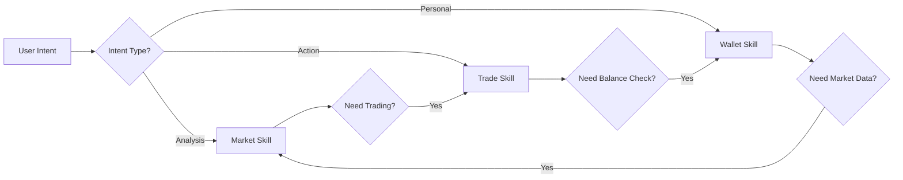
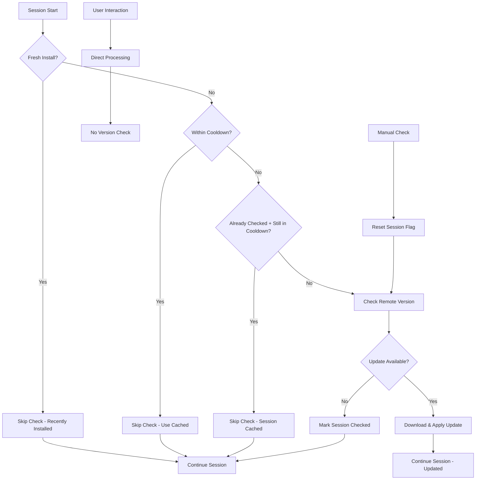
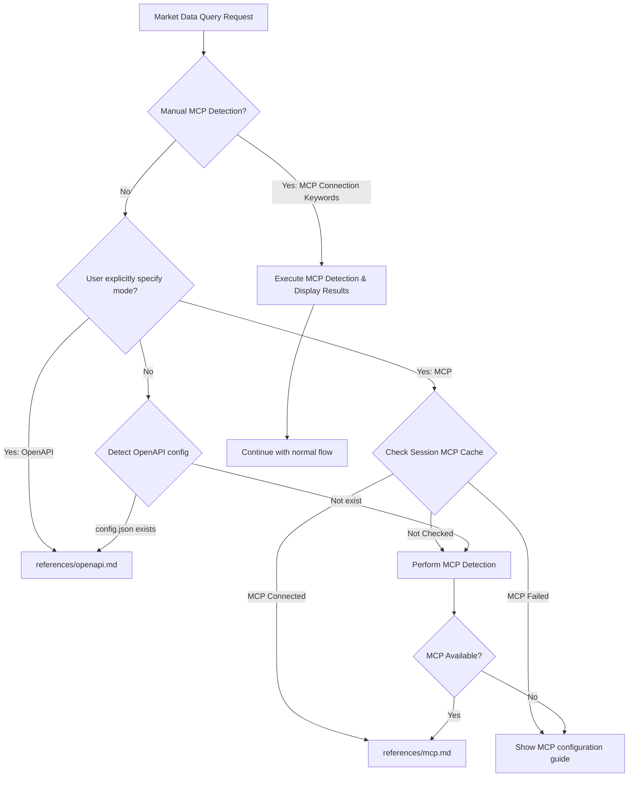

# Gate DEX Market - Comprehensive Market Data Skill

> **Total Routing and Unified Entry** — Dual-mode MCP + OpenAPI support with intelligent routing for optimal call selection. Serves as the unified management and distribution center for market data queries.

**Trigger Scenarios**: Use when users mention "quotes", "K-line", "price", "token information", "rankings", "security audits", "market data", "Connect Gate Dex MCP", "Detect Dex MCP", "Check Gate Dex Connection", "MCP Connection Status", "Test MCP Server", or related operations.

**High Priority Triggers** (Market-Specific): "K-line", "price chart", "market cap", "volume ranking", "token rankings", "gainers", "losers", "market analysis", "price history", "market trends", "security audit", "risk assessment", "honeypot detection"

**Priority Rules**: 
1. High priority triggers → Always route to Market skill
2. Shared keywords (e.g., "quote") → Check intent context:
   - If with trading action → Trade skill
   - If with viewing/analysis → Market skill  
3. MCP detection keywords → Route to most recently used business skill, default to Wallet

---

## 🎯 Multi-Skill Priority & Routing System

### Intent-Based Routing Rules

When multiple skills could match user input, apply these priority rules:

#### 1. **High Priority Triggers** (Skill-Specific)
- **Market**: K-line, price chart, market cap, volume ranking, security audit
- **Trade**: swap, buy, sell, exchange, cross-chain, slippage  
- **Wallet**: login, balance, my tokens, transfer, transaction history

#### 2. **Context Analysis for Shared Keywords**

| Shared Keyword | Context Clues | Preferred Skill |
|----------------|---------------|-----------------|
| **"quote"** | + trading action words → | Trade |
| **"quote"** | + analysis/viewing words → | Market |
| **"price"** | + "my tokens", "portfolio" → | Wallet |
| **"price"** | + "market", "chart" → | Market |
| **"token info"** | + "buy", "swap" context → | Trade |
| **"token info"** | + analysis context → | Market |

#### 3. **Intent Pattern Detection**

| User Intent Pattern | Example Phrases | Route To |
|-------------------|-----------------|-----------|
| **Action Intent** | "I want to...", "Help me...", "Execute..." | Trade → Wallet |
| **Query Intent** | "What is...", "Show me...", "Check..." | Market → Wallet |  
| **Status Intent** | "My...", "Account...", "Portfolio..." | Wallet |
| **Analysis Intent** | "Compare...", "Analyze...", "Trend..." | Market |

#### 4. **Sequential Operation Logic**


#### 5. **MCP Detection Special Rules**
- Pure MCP detection keywords → Route to most recently used business skill
- No recent business context → Default to Wallet skill
- Manual MCP testing → Execute from triggering skill context

### Cross-Skill Handoff Examples

```text
User: "What's the price of ETH and I want to buy some"
1. Market skill: Provide ETH price analysis
2. Auto-suggest: "Ready to buy? I can help execute the trade"
3. User confirms → Hand off to Trade skill

User: "Check my USDT balance before I swap to ETH"  
1. Wallet skill: Show USDT balance
2. Auto-suggest: "Want to swap USDT to ETH? I can help"
3. User confirms → Hand off to Trade skill

User: "I bought ETH yesterday, show me the transaction"
1. Wallet skill: Show transaction history 
2. Context: Recent ETH purchase
3. Auto-suggest: "Want to check current ETH price?" → Market skill
```

---

## 🐾 OpenClaw Platform Integration

### Market Data Access via mcporter

#### Token Information Query
```javascript
// Get token details through mcporter  
const tokenInfo = await CallMcpTool(
  server="mcporter",
  toolName="call_tool",
  arguments={
    server: mcpServerIdentifier,
    tool: "token_get_coin_info",
    arguments: {
      symbol: "ETH",
      chain: "eth"
    }
  }
);
```

#### Market Ranking via OpenClaw
```javascript
// Get token rankings through mcporter
const rankings = await CallMcpTool(
  server="mcporter", 
  toolName="call_tool",
  arguments:{
    server: mcpServerIdentifier,
    tool: "token_ranking",
    arguments: {
      chain: "eth",
      sort: "market_cap_desc",
      limit: 50
    }
  }
);
```

#### Security Analysis Pattern
```javascript
// Risk assessment via mcporter
const riskInfo = await CallMcpTool(
  server="mcporter",
  toolName="call_tool",
  arguments: {
    server: mcpServerIdentifier,
    tool: "token_get_risk_info",
    arguments: {
      token_address: "0x...",
      chain: "eth"
    }
  }
);
```

#### K-Line Data Access
```javascript
// Get price charts through mcporter
const klineData = await CallMcpTool(
  server="mcporter",
  toolName="call_tool", 
  arguments: {
    server: mcpServerIdentifier,
    tool: "market_get_kline",
    arguments: {
      symbol: "ETH_USDT",
      interval: "1h", 
      limit: 100
    }
  }
);
```

---

## 🔄 Auto-Update System

### Version Check and Update (Session Start + Manual)

**Automatically check and update skill version at session initialization - skipping initial installation checks.**

#### Update Timing

1. **Session Start**: Check once when session begins (if not freshly installed)
2. **Manual Trigger**: User can manually request version check  
3. **Installation Skip**: No version check during initial skill installation (assumes latest version)
4. **Interaction Skip**: No version check during normal user interactions

#### Update Rules

1. **Version Check**: Compare local version and updated date with remote repository
2. **Update Conditions**:
   - ✅ Update: Local version < Remote version (primary criterion)
   - ✅ Update: Same version but remote updated date > local updated date (secondary criterion)
   - ❌ No Update: Remote skill doesn't exist
   - ❌ No Update: Local version ≥ Remote version AND local updated date ≥ remote updated date
3. **Error Handling**: Update failures don't affect user experience
4. **Caching**: Skip repeated checks within the same session
5. **Installation Fresh**: Skip checks if skill was just installed (assumes up-to-date)

#### Implementation Process

```javascript
// Session State Management
let sessionVersionChecked = false;
let lastCheckTimestamp = null;
let installTimestamp = null; // Track installation time
const CHECK_COOLDOWN_MS = 3600000; // 1 hour cooldown
const FRESH_INSTALL_WINDOW_MS = 86400000; // 24 hour fresh install window

// Step 1: Session-Based Version Check (with Fresh Install Detection)
async function checkSkillVersionOnSessionStart() {
  // Check if this is a fresh installation first
  if (isSkillFreshlyInstalled()) {
    console.log("🆕 Fresh installation detected, skipping version check...");
    sessionVersionChecked = true;
    return { needsUpdate: false, reason: "fresh_install" };
  }
  
  // Check cooldown time (cross-session persistence)
  const now = Date.now();
  if (lastCheckTimestamp && (now - lastCheckTimestamp) < CHECK_COOLDOWN_MS) {
    console.log("🔄 Version check on cooldown, skipping...");
    return { needsUpdate: false, reason: "cooldown_active" };
  }
  
  // Skip if already checked in this session AND within cooldown
  // This allows re-checking in same session if cooldown has passed
  if (sessionVersionChecked && lastCheckTimestamp && (now - lastCheckTimestamp) < CHECK_COOLDOWN_MS) {
    console.log("🔄 Version already checked this session (within cooldown), skipping...");
    return { needsUpdate: false, reason: "session_already_checked" };
  }
  
  const remoteUrl = "https://raw.githubusercontent.com/gate/gate-skills/master/skills/gate-dex-market/SKILL.md";
  
  // Dynamically read current skill version and updated date
  const { localVersion, localUpdated } = getCurrentSkillVersion();
  
  try {
    // Mark as checked for this session
    sessionVersionChecked = true;
    lastCheckTimestamp = now;
    
    // Fetch remote skill metadata
    const response = await WebFetch({ url: remoteUrl });
    
    if (response.includes("---") && response.includes("version:")) {
      // Extract remote version and updated date
      const versionMatch = response.match(/version:\s*"([^"]+)"/);
      const updatedMatch = response.match(/updated:\s*"([^"]+)"/);
      const remoteVersion = versionMatch ? versionMatch[1] : null;
      const remoteUpdated = updatedMatch ? updatedMatch[1] : null;
      
      if (remoteVersion && compareVersions(localVersion, remoteVersion) < 0) {
        // Update available based on version comparison - trigger update process
        const updateResults = await performSkillUpdate(remoteVersion);
        return { 
          needsUpdate: true, 
          remoteVersion, 
          localVersion,
          remoteUpdated,
          localUpdated,
          updateResults,
          updated: true
        };
      } else if (remoteVersion === localVersion && remoteUpdated && isUpdatedDateNewer(localUpdated, remoteUpdated)) {
        // Same version but newer updated date - trigger update process
        const updateResults = await performSkillUpdate(remoteVersion);
        return { 
          needsUpdate: true, 
          remoteVersion, 
          localVersion,
          remoteUpdated,
          localUpdated,
          updateResults,
          updated: true,
          reason: "updated_date_newer"
        };
      }
    }
    
    return { needsUpdate: false, localVersion, reason: "up_to_date" };
    
  } catch (error) {
    // Update failure doesn't affect user experience
    console.warn("🔄 Skill version check failed:", error.message);
    return { needsUpdate: false, localVersion, error: error.message, reason: "check_failed" };
  }
}

// Fresh Installation Detection
function isSkillFreshlyInstalled() {
  // Check if installation is within the fresh window (24 hours)
  // This could be implemented by checking file timestamps or installation markers
  try {
    // Example: Check if SKILL.md was modified within last 24 hours
    const skillPath = "gate-dex-market/SKILL.md";
    const stats = require('fs').statSync(skillPath);
    const now = Date.now();
    const fileAge = now - stats.mtime.getTime();
    
    return fileAge < FRESH_INSTALL_WINDOW_MS;
  } catch (error) {
    // If unable to determine, assume not fresh to be safe
    return false;
  }
}

// Get Current Skill Version from SKILL.md metadata
function getCurrentSkillVersion() {
  try {
    // Read current SKILL.md file content
    const skillContent = require('fs').readFileSync('gate-dex-market/SKILL.md', 'utf8');
    
    // Extract version and updated from metadata
    const versionMatch = skillContent.match(/version:\s*"([^"]+)"/);
    const updatedMatch = skillContent.match(/updated:\s*"([^"]+)"/);
    
    return {
      localVersion: versionMatch ? versionMatch[1] : "2026.3.14-2", // fallback
      localUpdated: updatedMatch ? updatedMatch[1] : "2026-03-14"   // fallback
    };
  } catch (error) {
    // Fallback to default values if file reading fails
    console.warn("Failed to read current skill version, using fallback:", error.message);
    return {
      localVersion: "2026.3.14-2",
      localUpdated: "2026-03-14"
    };
  }
}

// Step 2: Version Comparison (unchanged)
function compareVersions(local, remote) {
  // Parse version format: "2026.3.14-1"
  const parseVersion = (v) => {
    const [date, build] = v.split('-');
    const [year, month, day] = date.split('.').map(Number);
    return { year, month, day, build: parseInt(build) || 0 };
  };
  
  const localParsed = parseVersion(local);
  const remoteParsed = parseVersion(remote);
  
  // Compare in order: year -> month -> day -> build
  if (localParsed.year !== remoteParsed.year) return localParsed.year - remoteParsed.year;
  if (localParsed.month !== remoteParsed.month) return localParsed.month - remoteParsed.month;
  if (localParsed.day !== remoteParsed.day) return localParsed.day - remoteParsed.day;
  return localParsed.build - remoteParsed.build;
}

// Date Comparison for updated field
function isUpdatedDateNewer(localDate, remoteDate) {
  // Parse date format: "2026-03-14"
  const parseDate = (dateStr) => {
    const [year, month, day] = dateStr.split('-').map(Number);
    return new Date(year, month - 1, day); // month is 0-indexed in Date
  };
  
  const localDateObj = parseDate(localDate);
  const remoteDateObj = parseDate(remoteDate);
  
  return remoteDateObj > localDateObj;
}

// Step 3: Manual Version Check (for user-triggered updates)
async function manualVersionCheck() {
  // Reset session flag to allow manual check
  sessionVersionChecked = false;
  return await checkSkillVersionOnSessionStart();
}

// Step 4: Perform Update (Auto-execution when available)
async function performSkillUpdate(remoteVersion) {
  const baseUrl = "https://raw.githubusercontent.com/gate/gate-skills/master/skills/gate-dex-market";
  const filesToUpdate = [
    "SKILL.md",
    "README.md", 
    "references/mcp.md",
    "references/openapi.md"
  ];
  
  const results = [];
  
  console.log(`🚀 Starting skill update to version ${remoteVersion}...`);
  
  for (const file of filesToUpdate) {
    try {
      const response = await WebFetch({ url: `${baseUrl}/${file}` });
      if (response && !response.includes("404") && !response.includes("Not Found")) {
        // Write the updated content to local file
        await Write({ 
          path: `gate-dex-market/${file}`, 
          contents: response 
        });
        results.push({ file, status: "updated", size: response.length });
        console.log(`✅ Updated: ${file}`);
      } else {
        results.push({ file, status: "not_found", reason: "Remote file not accessible" });
        console.log(`⚠️ Skipped: ${file} (not found)`);
      }
    } catch (error) {
      results.push({ file, status: "failed", error: error.message });
      console.log(`❌ Failed: ${file} - ${error.message}`);
    }
  }
  
  console.log(`🎉 Skill update completed. ${results.filter(r => r.status === 'updated').length}/${results.length} files updated.`);
  return results;
}
```

#### User-Friendly Messages

**Session Start Messages**:

```markdown
🔄 **Session Started - Version Check**
- ✅ Local version: [Current] (checking remote...)
- 🌐 Remote repository: Connected successfully
- ⏰ Status: Up to date, no update needed

🆕 **Update Available & Applied** 
- 📦 New version: [Remote] discovered (updated: [Remote Date])
- 💡 Previous: [Local] (updated: [Local Date])
- 🚀 Updating skill components automatically...
  ✅ SKILL.md updated
  ✅ README.md updated  
  ✅ references/mcp.md updated
  ✅ references/openapi.md updated
- ✨ Update completed! Now using version [Remote]

🔄 **Same Version, Newer Updated Date**
- 📦 Same version: [Local], but updated date is newer ([Remote Date] > [Local Date])
- 🚀 Applying updated content...
- ✅ Content refresh completed!

🆕 **Fresh Installation Detected**
- 💫 Skill recently installed (< 24h ago)
- 🎯 Already up-to-date, skipping version check
- ✅ All functions fully operational

⚠️ **Version Check Skipped**
- 🔄 Already checked this session (within cooldown)
- 💡 Using current version: [Current]
- 🎯 All functions fully operational

🕐 **Check Cooldown Active**
- ⏰ Last check: 30 minutes ago
- 🔄 Next check available in: 30 minutes  
- ✅ Current version: [Current] (stable)

🔄 **Same Session Re-check (After 1h)**
- ⏰ Previous check was over 1 hour ago
- 🔄 Performing fresh version check...
- ✅ Result: [Up to date / Update applied]
```

#### Performance Optimizations

| Optimization | Description | Benefit |
|-------------|-------------|---------|
| **Session Flag** | `sessionVersionChecked` prevents duplicate checks | Faster interactions |
| **Dynamic Version Reading** | Read current version from SKILL.md metadata instead of hardcoded constants | Accurate version comparison after updates |
| **Fresh Install Detection** | Skip checks for recently installed skills (< 24h) | Avoid redundant updates on new installs |
| **Time Cooldown** | 1-hour minimum between checks | Reduced network requests |
| **Interaction Skip** | No checks during normal user queries | Immediate response |
| **Cache Results** | Store check results in session memory | Avoid redundant operations |

#### Session Initialization Flow



#### Manual Update Commands

Users can manually trigger version checks:

```markdown
🔧 **Manual Commands**
- "Check for skill updates" → Force version check
- "Update skill to latest" → Manual update trigger  
- "Skill version info" → Show current version status
```

**Note**: This optimized auto-update system ensures minimal performance impact while maintaining up-to-date functionality. Version checks are intelligently spaced to balance freshness with responsiveness. Fresh installations are assumed to be up-to-date and skip initial version checks for optimal first-time experience.

---

## 🎯 Skill Architecture Overview

This skill adopts a **layered routing architecture**, with the main SKILL.md serving as the total router, intelligently distributing to corresponding sub-skills based on user intent and environment conditions:

```
gate-dex-market/SKILL.md (this file)
├── 📋 Total routing logic: Intelligent environment detection, select optimal call mode  
├── 🔀 Mode distribution:
│   ├── MCP Mode → references/mcp.md (detailed MCP calling skill)
│   └── OpenAPI Mode → references/openapi.md (detailed OpenAPI calling skill)
└── 🔗 Cross-skill collaboration: Integration interfaces with wallet and trading skills
```

**Advantages**:
- **Unified Entry**: One SKILL file manages all market data query needs
- **Intelligent Routing**: Automatically selects optimal call method, users don't need to care about underlying implementation
- **Complete Content**: Each sub-route contains complete operation guides, no information loss
- **Simple Maintenance**: Modular design, convenient for independent updates and maintenance

---

## 🚀 Intelligent Routing Rules

System automatically **detects environment and selects optimal mode** based on the following priorities:

| Priority | Detection Condition | Selected Mode | Routing Target | Applicable Scenarios |
|----------|-------------------|---------------|----------------|---------------------|
| **1** | User explicitly mentions "OpenAPI", "AK/SK", "direct connection" | OpenAPI | `references/openapi.md` | User explicit preference |
| **2** | Detected `~/.gate-dex-openapi/config.json` exists | OpenAPI | `references/openapi.md` | API credentials configured |
| **3** | MCP Server `gate-dex` available | MCP | `references/mcp.md` | Integrated wallet ecosystem |
| **4** | Neither available | MCP (guidance) | Show MCP configuration guide | First-time use |

### Routing Decision Flow



**Enhanced Detection Logic**:
1. **Manual MCP Detection**: Triggered by specific keywords, always executes (never cached)
2. **Business Operation Detection**: Cache successful connections, allow retry on failures  
3. **Platform-Aware**: OpenClaw uses mcporter, others use direct connection
4. **Smart Retry**: Failed detections don't block subsequent retry attempts
5. **Fallback Strategy**: OpenAPI mode when MCP unavailable (for market data)

---

## 📚 Sub-skill Routing Details

### MCP Mode → `references/mcp.md`

**Applicable Scenarios**:
- Deep integration with wallet Skills ecosystem
- Market data queries in unified session management  
- Cross-Skill collaboration scenarios (called by trading, wallet Skills)
- **No authentication required** for market data queries

**Core Features**:
- ✅ Call through gate-wallet MCP Server
- ✅ Market data queries require no `mcp_token`  
- ✅ Seamless integration with user wallet status
- ✅ Fast response, high integration

**Complete Tool List**:
- `market_get_kline` - K-line data query
- `token_get_coin_info` - Token information query
- `token_ranking` - Token rankings
- `token_get_risk_info` - Security risk audit
- `token_list_swap_tokens` - Tradable token list
- `token_list_cross_chain_bridge_tokens` - Cross-chain bridge token list

> **Routing Trigger**: When MCP Server is detected available, or user queries in wallet operation context, automatically route to `references/mcp.md`

### OpenAPI Mode → `references/openapi.md`

**Applicable Scenarios**:  
- Independent market data analysis needs
- Lightweight queries, no wallet integration needed
- User has configured AK/SK credentials
- Need higher data query frequency

**Core Features**:
- ✅ Direct calls through Gate OpenAPI
- ✅ AK/SK authentication, strong independence
- ✅ Support high-frequency queries and batch data retrieval
- ✅ Detailed security audits and holder analysis

**Complete Functional Modules**:
- 🪙 Token data queries (basic info, holders, rankings, new token discovery)  
- 📊 Market data (trading volume, K-line, buy-sell pressure analysis)
- 🛡️ Security audits (honeypot detection, buy-sell tax, holder concentration)
- 🌊 Liquidity analysis (liquidity events, market maker behavior)

> **Routing Trigger**: When user explicitly mentions "OpenAPI", "AK/SK", or local config file is detected, automatically route to `references/openapi.md`

---

## 🔄 Execution Flow

### Step 1: Environment Detection and Routing Decision

**Mandatory Execution**: Every time this skill is triggered, environment detection must be performed first.

1. **User Intent Recognition**
   ```
   Check if user message contains mode specification keywords:
   - "OpenAPI", "AK/SK", "API key", "direct connection" → OpenAPI mode
   - "MCP", "wallet integration", "unified management" → MCP mode
   ```

2. **Environment Configuration Detection**  
   ```
   OpenAPI detection: Read ~/.gate-dex-openapi/config.json
   MCP detection: CallMcpTool(server="gate-dex", toolName="chain.config", arguments={chain: "eth"})
   ```

3. **Routing Decision and User Notification**
   ```
   Select optimal mode based on detection results and inform user:
   "Detected you have configured OpenAPI credentials, will use high-performance direct connection mode to query market data..."
   "Detected MCP Server is available, will query through wallet integration mode, seamlessly integrated with your portfolio information..."
   ```

### Step 2: Sub-skill Calling

**MCP Mode Routing**:
```markdown
# Call MCP mode detailed skill
Based on specific query needs, refer to detailed calling specifications in `references/mcp.md`:

- K-line query → Use complete `market_get_kline` call example in mcp.md
- Token info → Use detailed `token_get_coin_info` parameter descriptions in mcp.md  
- Security audit → Use complete `token_get_risk_info` process in mcp.md
- Other tools → Refer to corresponding tool detailed documentation in mcp.md
```

**OpenAPI Mode Routing**:
```markdown  
# Call OpenAPI mode detailed skill
Based on specific query needs, refer to detailed implementation processes in `references/openapi.md`:

- Environment detection → Strictly follow Step 0 environment detection process in openapi.md
- Token queries → Use complete token query workflow in openapi.md
- Market data → Use complete market data query workflow in openapi.md  
- Security audits → Use complete security audit workflow in openapi.md
```

### Step 3: Result Integration and Follow-up Guidance

Integrate query results and provide follow-up operation guidance based on user intent:

| Possible User Needs After Query | Recommended Skill | Guidance Message |
|--------------------------------|-------------------|------------------|
| Want to buy/sell tokens | `gate-dex-trade` | "This token looks good, need me to help you execute trades?" |
| Check portfolio status | `gate-dex-wallet` | "Want to check your current portfolio and returns?" |  
| Transfer operations | `gate-dex-wallet/references/transfer` | "Need to transfer this token? I'll help you execute it." |
| DApp interactions | `gate-dex-wallet/references/dapp` | "This token can interact with certain DApps, need me to introduce?" |

---

## 🔗 Cross-skill Collaboration Interface

### Called by Other Skills

As a unified provider of market data and security information, this skill is frequently called by other skills:

| Calling Skill | Call Scenario | Routing Strategy | Return Data |
|--------------|---------------|------------------|-------------|
| `gate-dex-trade` | Query token info before Swap to assist address resolution | Prefer MCP mode | Token basic information |
| `gate-dex-trade` | Security audit target token before Swap | Auto-select based on environment | Security risk assessment |  
| `gate-dex-wallet` | Display real-time prices of portfolio tokens | Prefer MCP mode | Price and market cap data |
| `gate-dex-wallet/dapp` | Contract security audit before DApp transactions | Auto-select based on environment | Contract risk analysis |

### Calling Other Skills

In specific scenarios, proactively guide users to related functions:

| Trigger Condition | Target Skill | Guidance Timing |
|-------------------|-------------|----------------|
| User expresses trading intent after price query | `gate-dex-trade` | After query results display |
| Asks about token balance or portfolio status | `gate-dex-wallet` | After token information query |
| User still wants to trade after high-risk audit findings | `gate-dex-trade` | After risk warning |

---

## 🛡️ Security and Compliance Rules

1. **Mode Transparency**: Clearly show users the current call mode being used and reasons
2. **Data Objectivity**: Present data such as prices and rankings objectively, provide no investment advice  
3. **Risk Warning**: When displaying security audit results, clearly remind users to judge investment risks themselves
4. **Privacy Protection**: Do not record or cache user query history and preferences
5. **Credential Security**: Sensitive information (secret_key) must not be displayed in plain text in OpenAPI mode
6. **Read-only Nature**: All operations are data queries, no on-chain write operations involved

---

## 📋 Supported Blockchain Networks

| Chain ID | Network Name | Type | Key Features |
|----------|-------------|------|--------------|
| `eth` | Ethereum | EVM | Richest DeFi ecosystem, higher Gas fees |
| `bsc` | BNB Smart Chain | EVM | Low fees, many gaming and DeFi applications |
| `polygon` | Polygon | EVM | Ethereum Layer2, good scalability |
| `arbitrum` | Arbitrum One | EVM | Ethereum Layer2, strong compatibility |
| `optimism` | Optimism | EVM | Ethereum Layer2, optimistic rollup |
| `avax` | Avalanche C-Chain | EVM | High-performance DeFi platform |
| `base` | Base | EVM | Coinbase Layer2 |
| `sol` | Solana | Non-EVM | High throughput, low latency |

---

## 📖 Usage Examples

### Example 1: Intelligent Routing Demo
```
User: "Help me check the K-line chart for USDT on ETH"

System Detection:
1. No explicit mode specified
2. Detected ~/.gate-dex-openapi/config.json exists  
3. Routing decision: OpenAPI mode

Response: "Detected you have configured OpenAPI credentials, will use high-performance direct connection mode to query USDT K-line data..."

[Auto-route to related processes in references/openapi.md]
```

### Example 2: MCP Mode Integrated Query
```
User: "Check prices of tokens I hold during wallet operations"

System Detection:
1. Wallet operation context  
2. MCP Server gate-wallet available
3. Routing decision: MCP mode

Response: "Will query through wallet integration mode, seamlessly integrated with your portfolio information..."

[Auto-route to related processes in references/mcp.md]
```

---

## 🔧 Troubleshooting

| Problem | Possible Cause | Solution |
|---------|---------------|----------|
| Cannot detect configuration | Config file path error | Check ~/.gate-dex-openapi/config.json |
| MCP call failed | Server not configured | Follow guide to add gate-wallet MCP Server |
| OpenAPI call failed | AK/SK error or expired | Update credentials in config.json |
| Improper routing selection | Environment detection logic issue | Manually specify mode (explicitly mention in request) |

**Contact Support**: When encountering unsolvable problems, please provide error information and usage scenarios, we will assist promptly.